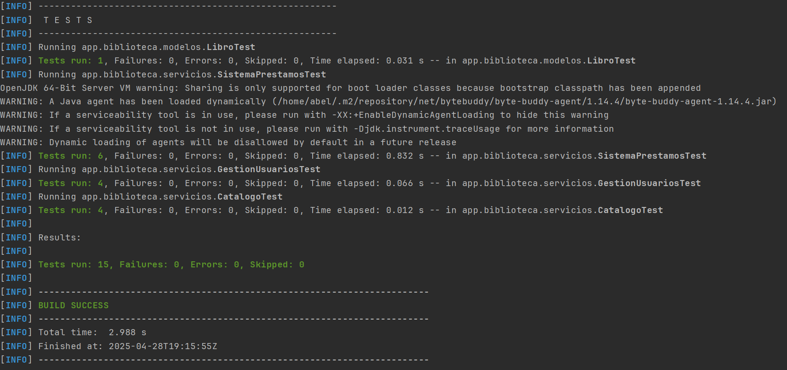

[](https://classroom.github.com/a/jpLeSJQi)
# Sistema de Gestión de Biblioteca - Práctica de Testing


<details>
<summary>
    📋<strong>Mostrar consigna completa</strong>
</summary>

## Tiempo Estimado y Recomendaciones
- **Tiempo estimado de realización:** 15 horas
- **Recomendación:** Se sugiere leer la consigna completa antes de comenzar con el desarrollo para tener una visión general del proyecto y planificar adecuadamente el trabajo.

## Importante
- La rama `main` está protegida y no se pueden hacer commits directos sobre ella
- Todo el trabajo debe realizarse en ramas feature siguiendo el patrón `feature/issue-numero-descripcion`
- Los cambios deben ser enviados mediante Pull Requests
- Cada Pull Request debe estar asociado a un Issue específico

## Requisitos Previos
- Java 21 o superior
- Maven
- Conocimientos básicos de Java y programación orientada a objetos

## Estructura del Proyecto
El proyecto está dividido en etapas incrementales, cada una enfocada en diferentes aspectos del testing. Cada etapa corresponde a un milestone en GitHub.

### Milestone 1: Configuración Inicial y Pruebas Básicas
**Objetivos de Aprendizaje:**
- Familiarizarse con la configuración de un proyecto Maven
- Aprender a escribir pruebas unitarias básicas con JUnit5
- Entender el concepto de assertions y su uso

**Issues Sugeridos:**
1. #1 Configuración inicial del proyecto Maven
2. #2 Implementación de la clase Libro
3. #3 Pruebas unitarias básicas para Libro

**Tareas:**
1. Configurar el proyecto Maven con las dependencias necesarias
2. Implementar la clase `Libro` con los siguientes atributos:
   - ISBN (String)
   - Título (String)
   - Autor (String)
   - Estado (Enum: DISPONIBLE, PRESTADO)
3. Escribir pruebas unitarias para:
   - Creación de un libro con datos válidos
   - Cambio de estado del libro

**Ejemplo de Guía:**
```java
@Test
void testCrearLibroValido() {
    Libro libro = new Libro("978-3-16-148410-0", "Clean Code", "Robert C. Martin");
    assertEquals("978-3-16-148410-0", libro.getIsbn());
    assertEquals("Clean Code", libro.getTitulo());
    assertEquals("Robert C. Martin", libro.getAutor());
    assertEquals(Estado.DISPONIBLE, libro.getEstado());
}
```

### Milestone 2: Implementación del Catálogo
**Objetivos de Aprendizaje:**
- Practicar el uso de colecciones en Java
- Aprender a escribir pruebas para métodos que manejan colecciones

**Issues Sugeridos:**
1. #4 Implementación de la clase Catalogo
2. #5 Pruebas para métodos de búsqueda

**Tareas:**
1. Implementar la clase `Catalogo` con los siguientes métodos:
   - Agregar libro
   - Buscar libro por ISBN
   - Obtener todos los libros disponibles
2. Escribir pruebas unitarias que incluyan:
   - Pruebas con múltiples libros
   - Búsquedas exitosas y fallidas

**Ejemplo de Guía:**
```java
@BeforeEach
void setUp() {
    catalogo = new Catalogo();
    libro1 = new Libro("978-3-16-148410-0", "Clean Code", "Robert C. Martin");
    libro2 = new Libro("978-0-13-235088-4", "Clean Architecture", "Robert C. Martin");
    catalogo.agregarLibro(libro1);
    catalogo.agregarLibro(libro2);
}

@Test
void testBuscarPorIsbn() {
    Libro libro = catalogo.buscarPorIsbn("978-3-16-148410-0");
    assertNotNull(libro);
    assertEquals("Clean Code", libro.getTitulo());
}
```

### Milestone 3: Sistema de Préstamos
**Objetivos de Aprendizaje:**
- Aprender a usar Mockito para simular dependencias
- Practicar el uso de mocks en pruebas unitarias

**Issues Sugeridos:**
1. #6 Implementación de la clase Prestamo
2. #7 Implementación de SistemaPrestamos
3. #8 Pruebas con mocks

**Tareas:**
1. Implementar las clases:
   - `Prestamo` (fecha de préstamo, libro)
   - `SistemaPrestamos` (gestión de préstamos)
2. Escribir pruebas que utilicen mocks para:
   - Simular el catálogo de libros
   - Probar el flujo de préstamo

**Ejemplo de Guía:**
```java
@Mock
private Catalogo catalogo;

@InjectMocks
private SistemaPrestamos sistemaPrestamos;

@Test
void testPrestarLibro() {
    Libro libro = new Libro("978-3-16-148410-0", "Clean Code", "Robert C. Martin");
    when(catalogo.buscarPorIsbn("978-3-16-148410-0")).thenReturn(libro);
    
    Prestamo prestamo = sistemaPrestamos.prestarLibro("978-3-16-148410-0");
    
    assertNotNull(prestamo);
    verify(catalogo).buscarPorIsbn("978-3-16-148410-0");
    assertEquals(Estado.PRESTADO, libro.getEstado());
}
```

### Milestone 4: Sistema de Usuarios
**Objetivos de Aprendizaje:**
- Practicar el uso de múltiples mocks en una prueba
- Aprender a manejar excepciones en pruebas

**Issues Sugeridos:**
1. #9 Implementación de la clase Usuario
2. #10 Implementación de GestionUsuarios
3. #11 Pruebas con múltiples mocks

**Tareas:**
1. Implementar las clases:
   - `Usuario` (nombre, historial de préstamos)
   - `GestionUsuarios` (registro de usuarios)
2. Escribir pruebas que:
   - Utilicen múltiples mocks
   - Prueben el manejo de excepciones

**Ejemplo de Guía:**
```java
@Mock
private Catalogo catalogo;

@Mock
private SistemaPrestamos sistemaPrestamos;

@InjectMocks
private GestionUsuarios gestionUsuarios;

@Test
void testRegistrarPrestamo() {
    Usuario usuario = new Usuario("usuario1");
    Libro libro = new Libro("978-3-16-148410-0", "Clean Code", "Robert C. Martin");
    
    when(catalogo.buscarPorIsbn("978-3-16-148410-0")).thenReturn(libro);
    when(sistemaPrestamos.prestarLibro("978-3-16-148410-0"))
        .thenReturn(new Prestamo(libro));
    
    gestionUsuarios.registrarPrestamo("usuario1", "978-3-16-148410-0");
    
    verify(sistemaPrestamos).prestarLibro("978-3-16-148410-0");
    assertEquals(1, usuario.getHistorialPrestamos().size());
}
```

## Entregables
Cada etapa debe ser entregada a través de un Pull Request que incluya:
1. Código fuente implementado
2. Pruebas unitarias correspondientes
3. Documentación de los cambios realizados
4. Evidencia de que las pruebas pasan correctamente

## Consideraciones Éticas sobre el Uso de IA
El uso de Inteligencia Artificial (IA) como herramienta de asistencia en el desarrollo de software es una práctica cada vez más común. Sin embargo, es importante considerar los siguientes aspectos éticos:

1. **Transparencia y Honestidad**
   - Declarar el uso de IA en el desarrollo del trabajo
   - Documentar cómo se utilizó la IA como herramienta de asistencia
   - No presentar código generado por IA como propio sin revisión y comprensión

2. **Aprendizaje y Comprensión**
   - La IA debe ser utilizada como una herramienta de aprendizaje, no como un reemplazo del pensamiento crítico
   - Es fundamental entender el código generado y las pruebas implementadas
   - El estudiante debe ser capaz de explicar y justificar las decisiones tomadas

3. **Responsabilidad**
   - El estudiante es responsable final de la calidad y corrección del código
   - Las pruebas deben ser verificadas y validadas personalmente
   - El código debe ser revisado y comprendido antes de su entrega

4. **Uso Apropiado**
   - La IA debe ser utilizada para asistir en el aprendizaje, no para evadir el proceso de desarrollo
   - Las consultas a la IA deben ser específicas y enfocadas en el aprendizaje
   - No se debe depender exclusivamente de la IA para resolver problemas

5. **Integridad Académica**
   - El trabajo final debe reflejar el aprendizaje y comprensión del estudiante
   - La IA es una herramienta de asistencia, no un sustituto del aprendizaje
   - Se espera que el estudiante demuestre su comprensión de los conceptos a través de su implementación

## Recursos Adicionales
- [Documentación de JUnit5](https://junit.org/junit5/docs/current/user-guide/)
- [Documentación de Mockito](https://javadoc.io/doc/org.mockito/mockito-core/latest/org/mockito/Mockito.html)
- [Guía de Maven](https://maven.apache.org/guides/)
</details>

## 📑 Índice
- [📌 Objetivo General](#-objetivo-general)
- [👨‍🎓 Identificación del Alumno](#-identificación-del-alumno)
- [📂 Estructura del Proyecto](#-estructura-del-proyecto)
- [🚀 Instalación y uso del proyecto](#-instalación-y-uso-del-proyecto)
- [✅ Resultados de las pruebas](#-resultados-de-las-pruebas)
- [🤖 Asistencia de IA en el desarrollo](#-asistencia-de-ia-en-el-desarrollo)

## 📌 Objetivos Generales
Este proyecto tiene como objetivo desarrollar habilidades en testing unitario utilizando JUnit5 y Mockito en Java. A través de la implementación de un sistema de gestión de biblioteca, se aprenderán a escribir pruebas unitarias efectivas y a utilizar mocks para simular dependencias.

## 👨‍🎓 Identificación del Alumno
- **Nombre:** Abel
- **Apellido:** Carrizo
- **Legajo:** 59164

## 📂 Estructura del Proyecto

```text
sistemaGestionBiblioteca/
├── .gitignore      # Archivos ignorados
├── README.md       # Documentación
├── pom.xml         # Configuración Maven
└── src
    ├── main        # Código principal de la aplicación
    │   └── java
    │       └── app
    │           └── biblioteca
    │               ├── modelos
    │               │   │── Libro.java          # Modelo de Libro
    │               │   │── Estado.java         # Enum de estados
    │               │   │── Prestamo.java       # Modelo de Prestamo
    │               │   └── Usuario.java        # Modelo de Usuario
    │               └── servicios
    │                   │── Catalogo.java           # Servicio de Catalogo
    │                   │── GestionUsuarios.java    # Servicio de Gestion de Usuarios
    │                   └── SistemaPrestamos.java   # Servicio de Prestamos
    │                   
    └── test    # Pruebas del proyecto
        └── java
            └── app
                └── biblioteca
                    ├── modelos
                    │   └── LibroTest.java      # Pruebas de Libro
                    └── servicios
                        │── CatalogoTest.java               # Pruebas de Catalogo
                        │── GestionUsuariosPruebas.java     # Pruebas de Gestion de Usuarios
                        └── SistemaPrestamosTest.java       # Pruebas de Sistema de Prestamos
```

---

## 🚀 Instalación y uso del proyecto

1. **Clonar el repositorio**:

```bash
git clone https://github.com/um-programacion-ii/programacion-2-trabajo-practico-3-abelCarrizo.git
cd programacion-2-trabajo-practico-3-abelCarrizo/sistemaGestionBiblioteca/
```

2. **Ejecutar las pruebas**:

Para validar la aplicación con pruebas unitarias (JUnit + Mockito):

```bash
mvn clean test
```

---

## ✅ Resultados de las pruebas

A partir del comando mencionado en el punto anterior para ejecutar las pruebas se obtuvieron los siguientes resultados:



Estos resultados verifican la correcta ejecución de los test.

---

## 🤖 Asistencia de IA en el desarrollo

- **Comprender las librerías JUnit y Mockito**  
  Gracias a la IA logré entender qué son estas herramientas, para qué sirven y cómo encajan en el flujo de pruebas unitarias en Java.

- **Interpretar la documentación oficial**  
  La IA ayudó a filtrar y resumir los puntos más relevantes de las guías y manuales, resaltando las mejores prácticas y ejemplos de uso.

- **Recomendaciones para filtrar y organizar datos**  
  Obtuve sugerencias sobre cómo estructurar los tests, estandarizar nombres de casos de prueba y priorizar las validaciones esenciales.

- **Autocompletado de código**  
  Utilicé la IA para generar rápidamente getters, setters y cadenas de texto repetitivas (por ejemplo, mensajes de error en excepciones), ahorrando tiempo y evitando errores tipográficos.

- **Instanciación de objetos de prueba**  
  La IA me ayudó a crear un nuevo objeto `Libro` para agilizar la preparación de escenarios.

- **Documentación de la estructura del proyecto**
  Gracias a la IA puedo presentar la estructura del proyecto de una manera más personalizada y luego de a partir de ella seguir añadiendo nuevas clases.
  Además, ayudó en la creación de los iconos para cada título.
